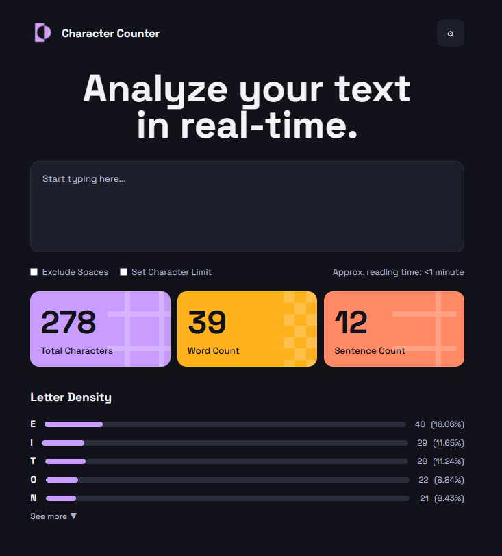

<div align="center">

# 🔤 Character Counter

### Proyecto de Maquetado Web con HTML, CSS y Responsive Design

</div>

---

# 📖 Objetivo del Proyecto

Este proyecto consiste en la recreación visual de una interfaz de análisis de texto llamada **Character Counter**, utilizando únicamente **HTML y CSS**.

El objetivo principal fue aplicar conceptos de:

* HTML semántico
* CSS moderno
* Flexbox
* Diseño Responsive
* Variables CSS
* Hover Effects
* Organización de proyectos
* Control de versiones con Git y GitHub

---

# 📂 Estructura del Proyecto

```txt
character-counter/
│── index.html
│── styles.css
│── assets/
│ └── images/
│        └── logo.png
└── README.md
```

---

# 🏗 Organización del HTML

La página fue dividida en distintas secciones semánticas:

### Header

Contiene:

* Logo del sitio
* Botón de configuración

### Hero Section

Contiene:

* Título principal
* Área de texto (`textarea`)

### Controles

Contiene:

* Checkbox "Exclude Spaces"
* Checkbox "Set Character Limit"
* Tiempo estimado de lectura

### Tarjetas de Estadísticas

Se implementaron tres tarjetas:

* Total Characters
* Word Count
* Sentence Count

### Letter Density

Sección destinada a mostrar:

* Letras más frecuentes
* Barras de progreso
* Cantidades y porcentajes

---

# 🎨 Organización del CSS

Para mejorar la mantenibilidad del código se utilizaron:

```yaml
Variables CSS:
  - Colores
  - Bordes
  - Radios

Layout:
  - Flexbox
  - Responsive Design

Efectos:
  - Hover
  - Transiciones
  - Sombras
  - Scrollbar personalizada

Componentes:
  - Header
  - Hero
  - Controls
  - Cards
  - Letter Density
```

---

# 📱 Diseño Responsive

El proyecto fue adaptado para:

* Computadoras de escritorio
* Tablets
* Dispositivos móviles

Se utilizaron **Media Queries** para ajustar:

* Tamaños de fuente
* Distribución de elementos
* Tarjetas
* Controles
* Barras de densidad

---

# ⚠ Dificultades Encontradas

Durante el desarrollo se se me complicaron varias cosas:

* Replicar fielmente la interfaz de referencia.
* Mantener una estructura HTML semántica.
* Diseñar tarjetas responsive (esto mas que nada, no pude replicarlo tal cual).
* Crear barras de progreso únicamente con HTML y CSS.
* Ajustar correctamente los espacios y tamaños para distintos dispositivos.

---

# 📸 Capturas del Resultado Final

Agregar las capturas antes de la entrega:

```md


```

---

# 🛠 Tecnologías Utilizadas

<div align="center">


</div>

---

# 🚀 Autor

Ciro Bernardez
